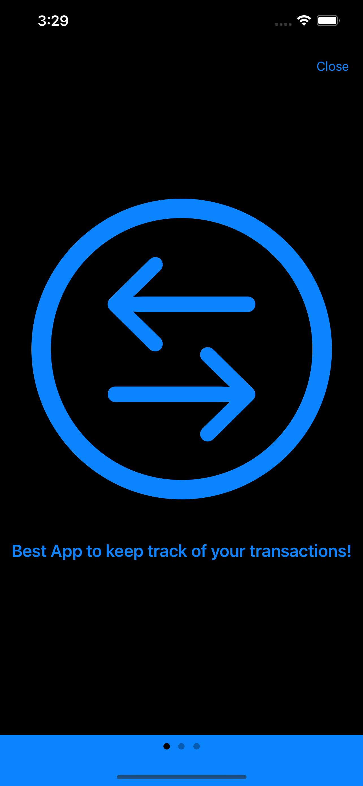
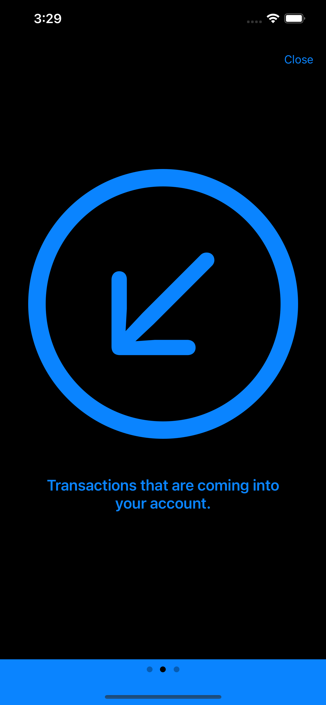
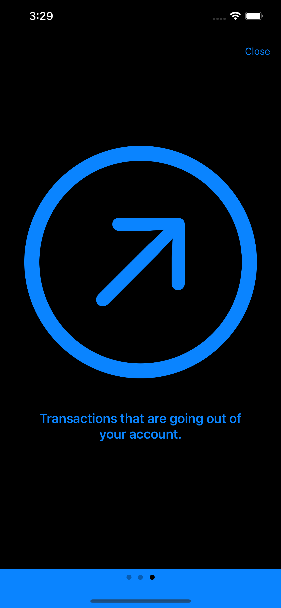
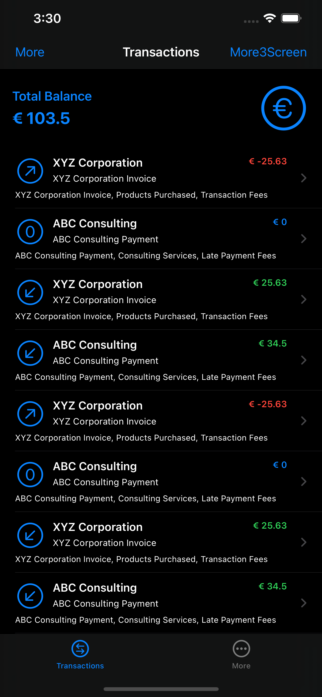
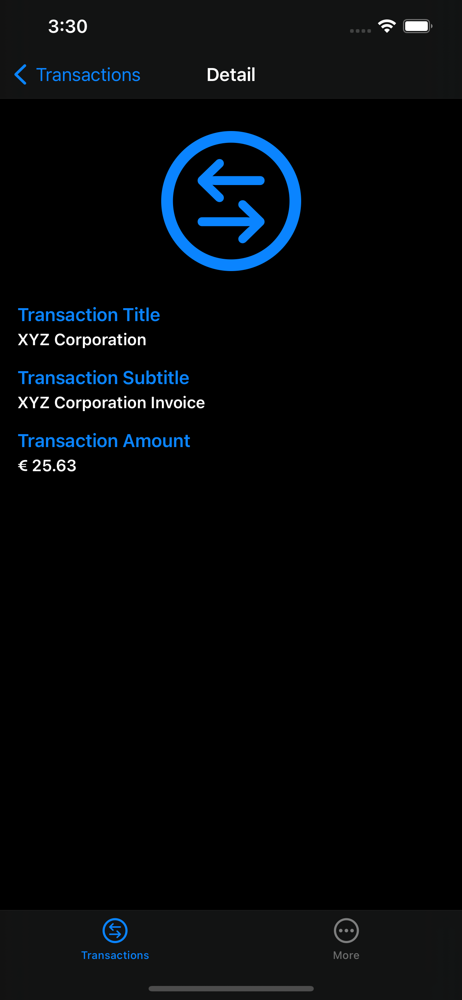

# Banking App

## Table of contents
* [Description](#description)
* [Features](#Features)
* [General info](#general-info)
* [Screenshots](#screenshots)
* [Architecture](#architecture)
* [Contact](#contact)

## Description

Banking app is a mobile application that displays banking transactions to the user. The app employs the Model-View-ViewModel (MVVM) design pattern to separate the business logic and data from the user interface (UI) layer. The Model contains the data about the user's banking transactions, while the ViewModel is responsible for updating the Model from user inputs and updating the View with the updated Model data. The View represents the user interface components such as tables, labels, and buttons.

Furthermore, the app utilizes the Coordinators pattern to handle navigation and flow between screens. The Coordinators are objects that encapsulate navigation logic and provide a single entry point for routing between the ViewControllers. The Coordinators communicate with the ViewModels to retrieve the required data and update the ViewControllers accordingly.

With these patterns, the banking app delivers a clear separation of concerns, maintainable and scalable codebase, and improved user experience with seamless navigation and a rich user interface.

## Features

- As a user I want to see a tour/splash screen at the first start of the app (just use a blank screen with a close button).
- As a user I want to see a list of transactions.
- As a user I want to be informed if loading of transactions is in progress or failed.
- As a user I want to retry loading of transactions when initial loading failed.
- As a user I want to see the `title`, `subtitle`, `additionalTexts.lineItems` and `amount` of the transaction in the list of transactions.
- As a user I want to select a transaction and see more details.
- As a user I want to see the sum of all transactions above the list of transactions.

Choose an approach and app architecture you think of as most suitable for building an app which has to be maintained over a long time by a large team and which will get constantly extended. 

Make sure to add proper and sufficient unit testing.

## General info

### Human Interface Guidelines
* The application uses Apple's Human Interface Guidelines and native UI elements and it also adapts to the dark mode.

### Project Setup
The application views are all written in code and xib file because there are a few considerations:

* Storyboards are more prone to version conflicts due to their complex XML structure. This makes merging much harder than with code.
* It's easier to structure and reuse views in code, thereby keeping your codebase DRY.
* All information is in one place. In Interface Builder you have to click through all the inspectors to find what you're looking for.
* Storyboards introduce coupling between your code and UI, which can lead to crashes e.g. when an outlet or action is not set up correctly. These issues are not detected by the compiler.
* You can create the constraints in code and create a more complex UI layout.

## Screenshots

Onboarding Screen1         |  Onboarding Screen2
:-------------------------:|:-------------------------:
  |  

Onboarding Screen3         |  Transactions List
:-------------------------:|:-------------------------:
          |  

Retry Screen               |  Transactions Detail
:-------------------------:|:-------------------------:
          |  

## Architecture

#### Service + Model-View-ViewModel + Coordinator :

#### Service:

- The Service Layer is based on the concept that a system should be separated into different layers, with different responsibilities on each of those layers.
- The service layer should be the connection to the outside world, whether that be a database, a remote server, etc.
- It should contain multiple Services and each one of those should have a single responsibility of dealing with a specific kind of service or resource.
- It allows you to move logic related to frameworks and APIs into their own class or struct, a good practice is to create a protocol and add the required methods and computed properties. 
- Your implementation will be a class or a struct that conforms to this protocol.
- This allows you to create Mock services that enable you to better test your code.

#### Model:

- The Model layer is responsible for representing the data from our business logic.

#### View:

- The View layer is responsible for handling all the layouts and displaying the data user-friendly. 
- The View knows the ViewModel but doesn't know the model.

#### ViewModel:

- The ViewModel layer is responsible for transforming the data received in a View-representative way, receiving actions from the View, and dealing with our business logic.
- It contains data binding that tells whoever is listening about those changes. 
- The ViewModel Knows the Model layer but doesn’t know the View layer. 

#### Coordinator:

- The Coordinator layer comes to help in situations where you need to decouple the flow of your app from your view controllers.
- It allows us to control the flow of our app and avoid putting navigation logic directly into controllers. 
- It allows us to have reusable View Controllers.
- It also helps us isolate view controllers from each other, which comes in handy when we want to reuse them across our projects. 
- It makes it easier to build new flows in the app.

## Contact
Kevin Topollaj, email: kevintopollaj@gmail.com - feel free to contact me!
