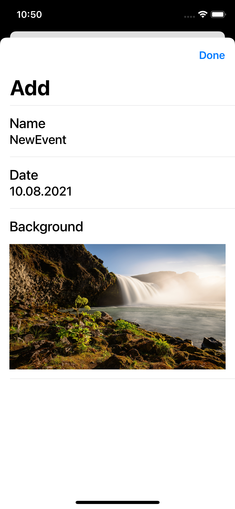
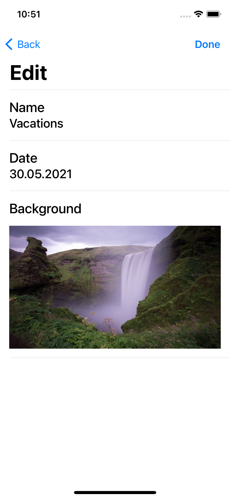

# Event Countdown

## Table of contents
* [Screenshots](#screenshots)
* [Description](#description)
* [General info](#general-info)
* [Technologies](#technologies)
* [Architecture](#architecture)
* [DesignPattern](#designpattern)
* [Features](#features)
* [Contact](#contact)

## Screenshots

Event List            |  Add Event
:-------------------------:|:-------------------------:
 | 

Event Detail           |  Edit Event
:-------------------------:|:-------------------------:
 | 

## Description
Event Countdown is a sophisticated mobile application designed to facilitate effortless event tracking. With Event Countdown, users can easily store and manage multiple events, each of which is assigned a unique title and a specific date of occurrence. The application further enhances the user experience by presenting the remaining number of years, months, and days until each event.

Notably, Event Countdown's intuitive interface allows users to seamlessly add new events, view event details, and edit existing events, all of which are efficiently managed through CoreData. Additionally, the application supports customization by enabling users to personalize each event with a unique background image.

Overall, Event Countdown is a powerful mobile application that provides a streamlined and professional approach to event management.

## General info

### Human Interface Guidelines
* The application uses Apple's Human Interface Guidelines, native UI elements and it also adapts to the dark mode.

### Project Setup
The application views are all written in code and using storyboard.

## Technologies
* Swift
* Xcode
* UIKit
* Foundation
* CoreData

## Architecture
#### Model-View-ViewModel (MVVM):
* Model: 
The Model where your data resides. Things like persistence, model objects, parsers, core data managers, and networking code live.
* View:
The user interface’s visual elements. In iOS, the view controller is inseparable from the concept of the view.
* ViewModel:
Updates the model from view inputs and updates views from model outputs.

## DesignPattern
* Coordinator
* Service
* Dependency Injection

## Features
* Display events and their data in a table view from CoreData.
* Add event.
* Display Details for a specific event.
* Edit event.

## Contact
Kevin Topollaj, email: kevintopollaj@gmail.com - feel free to contact me!
