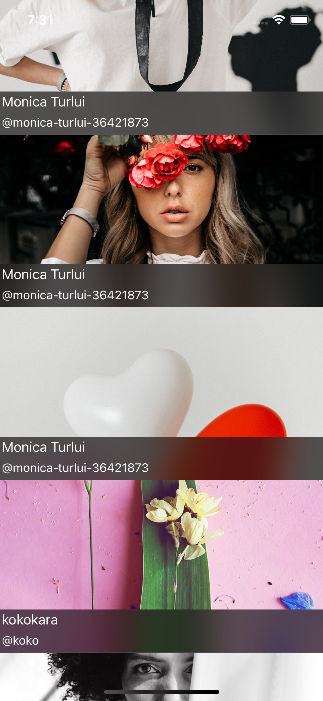

# PhotoBrowser

## Table of contents
* [Description](#description)
* [General info](#general-info)
* [Screenshots](#screenshots)
* [Technologies](#technologies)
* [Architecture](#architecture)
* [DesignPattern](#designpattern)
* [Features](#features)
* [Contact](#contact)

## Description
Photo Browser is a mobile application where you can display and cache images from Pexels API by creating an infinite scrolling and display the full image by tapping in a specific image.

## General info

### Human Interface Guidelines
* The application uses Apple's Human Interface Guidelines, native UI elements and it also adapts to the dark mode.

### Project Setup
The application views are all written in code.

## Screenshots

Images List            |  Image Detail
:-------------------------:|:-------------------------:
  |  

## Technologies
* Swift
* Xcode
* UIKit
* Foundation
* NSCache

## Architecture
#### Model-View-ViewModel (MVVM):
* Model: 
The Model where your data resides. Things like persistence, model objects, parsers, core data managers, and networking code live.
* View:
The user interface’s visual elements. In iOS, the view controller is inseparable from the concept of the view.
* ViewModel:
Updates the model from view inputs and updates views from model outputs.

## DesignPattern

* Delegation
* Target / Action

## Features

* Abstract Networking Layer
* Enum for Endpoint Management
* Swift Generics
* Protocol Oriented Approach
* Efficiently Loading Images in TableView
* Loading Network Images
* Async Image Loading and Caching
* Handle image download cancellation when row is no longer visible
* Handle cell reuse in tableView
* Infinite Loading Cell

## Contact
Kevin Topollaj, email: kevintopollaj@gmail.com - feel free to contact me!
