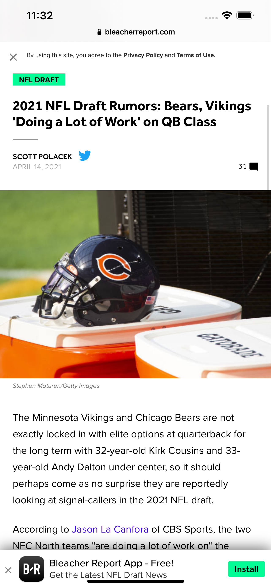

# NewsApp

## Table of contents
* [Description](#description)
* [General info](#general-info)
* [Screenshots](#screenshots)
* [Technologies](#technologies)
* [Architecture](#architecture)
* [DesignPattern](#designpattern)
* [Features](#features)
* [Contact](#contact)

## Description
News App is a mobile application where you can display and cache images from News API and display them into a list and by selecting a news it will display the full article using SafariServices.

## General info

### Human Interface Guidelines
* The application uses Apple's Human Interface Guidelines, native UI elements and it also adapts to the dark mode.

### Project Setup
The application views are all written in code.

In order to run the application you must have an API key provided by: [newsapi](https://newsapi.org/)

## Screenshots

News List            |  News Detail in Safari
:-------------------------:|:-------------------------:
  |  

## Technologies
* Swift
* Xcode
* UIKit
* Foundation
* NSCache

## Architecture
#### Model-View-ViewModel (MVVM):
* Model: 
The Model where your data resides. Things like persistence, model objects, parsers, core data managers, and networking code live.
* View:
The user interface’s visual elements. In iOS, the view controller is inseparable from the concept of the view.
* ViewModel:
Updates the model from view inputs and updates views from model outputs.

## DesignPattern

* Singleton
* Target / Action

## Features

* Using NSCache to cache images
* Make Network API calls
* Build programmatic layout
* Use MVVM architecture
* Build reusable views
* Custom Image View with Shadow
* Implement SafariServices

## Contact
Kevin Topollaj, email: kevintopollaj@gmail.com - feel free to contact me!
