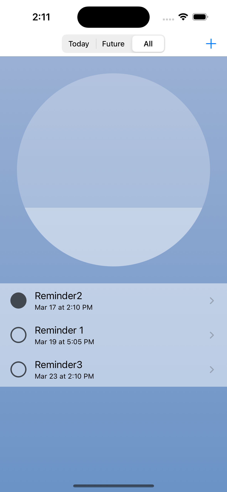
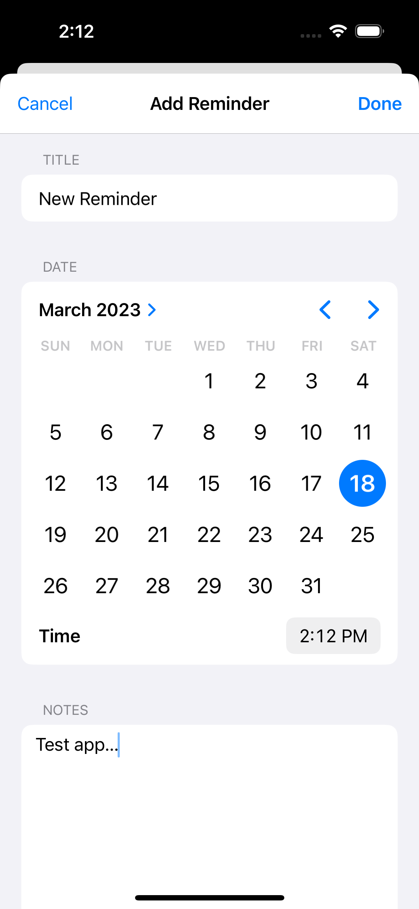
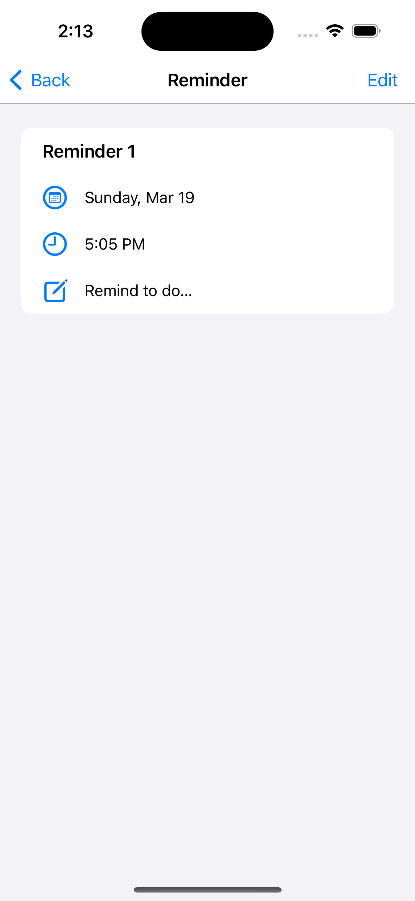
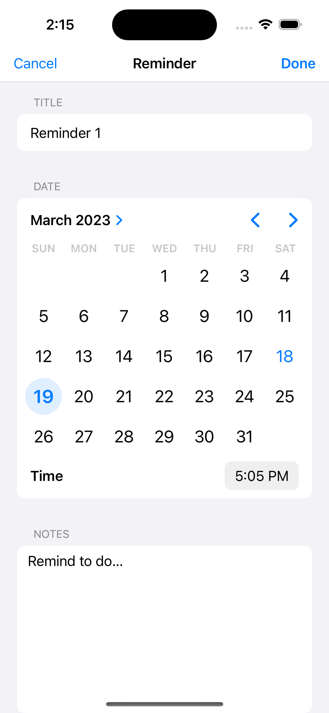
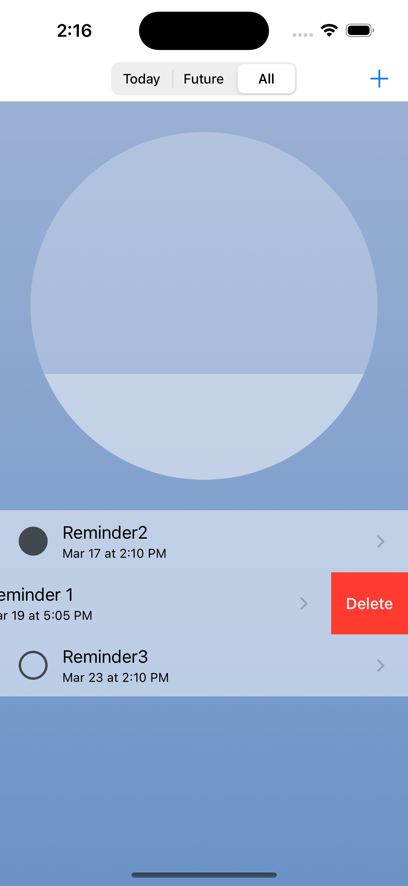
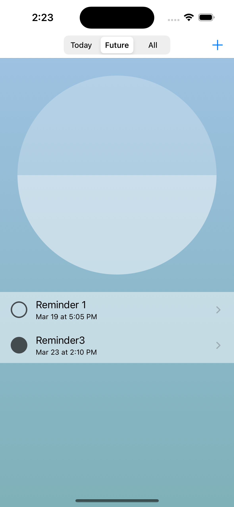

# Reminder App

## Table of contents
* [Description](#description)
* [General info](#general-info)
* [Screenshots](#screenshots)
* [Technologies](#technologies)
* [Architecture](#architecture)
* [Features](#features)
* [Contact](#contact)

## Description

The Reminder app is a highly functional and user-friendly mobile application that enables users to set and manage reminders for various tasks and events. The app's intuitive interface and comprehensive feature set provide a seamless and streamlined experience for users.

With the Reminder app, users can easily create reminders for important events, deadlines, appointments, and more. Users can customize the reminder by setting a specific date and time, choosing a unique tone or sound, and adding relevant notes or details.

The app's intelligent notification system ensures that users never miss a reminder, with timely alerts and notifications delivered to the user's device. The app's advanced calendar integration enables users to view and manage their reminders alongside their daily schedule, providing an efficient and streamlined approach to task management.

Overall, the Reminder app is a powerful and reliable tool for anyone looking to enhance their productivity and manage their daily tasks more efficiently. Its robust feature set, intuitive interface, and intelligent notification system make it an excellent choice for professionals and casual users alike.

## General info

### Human Interface Guidelines
* The application uses Apple's Human Interface Guidelines, native UI elements and it also adapts to the dark mode.

### Project Setup
The application views are all written in code.

## Screenshots

Reminders List            |  New Reminder
:-------------------------:|:-------------------------:
  |  

Reminder Detail           |  Edit Reminder
:-------------------------:|:-------------------------:
  |  

Delete Reminder           |  Filter Reminder
:-------------------------:|:-------------------------:
  |  

## Technologies
* Swift
* Xcode
* UIKit
* Foundation

## Architecture

MVC is a widely used architectural pattern in iOS development. It separates the application into three interconnected components: Model, View, and Controller.

The Model component handles data storage and processing, while the View component encompasses the visual elements of the application. The Controller mediates between the Model and View, updating the Model based on user input and updating the View with the appropriate data output.

MVC enables developers to build complex and scalable applications by providing a structured and organized development process. Its efficient and effective approach to application development has made it a popular choice among iOS developers.

## Features

- Implement `UICollectionView` using `UICollectionViewCompositionalLayout`.
- Implement `UICollectionViewDiffableDataSource`.
- Implement `NSDiffableDataSourceSnapshot` and add it the `UICollectionViewDiffableDataSource`.
- Implemet `Identifiable` protocol to uniqly identify an Object.
- Implement `Accessibility` to VoiceOver users.
- Implement navigation to a new Detail ViewController based on the id.
- Implement customization of the `NavigationBarAppearance`.
- Implement Editing mode.
- Implement Adding.
- Implement Deleting.
- Implement Filtering.
- Implement UISegmentedControl.
- Implement Custom View as a header.
- Implement Animation.
- Implement constraints programmatically.
- Implement Gradients using `CAGradientLayer`.
- Implement the `EventKit` framework to request access to a user’s calendar events and reminders and to share data between the Reminders and Your apps.
- Implement Swift concurrency techniques as you integrate with the EventKit API.
- Implement a store abstraction to facilitate the persistence of the data.
- Implement permission to access user data.
- Implement the respond to change notifications.

 
## Contact
Kevin Topollaj, email: kevintopollaj@gmail.com - feel free to contact me!
