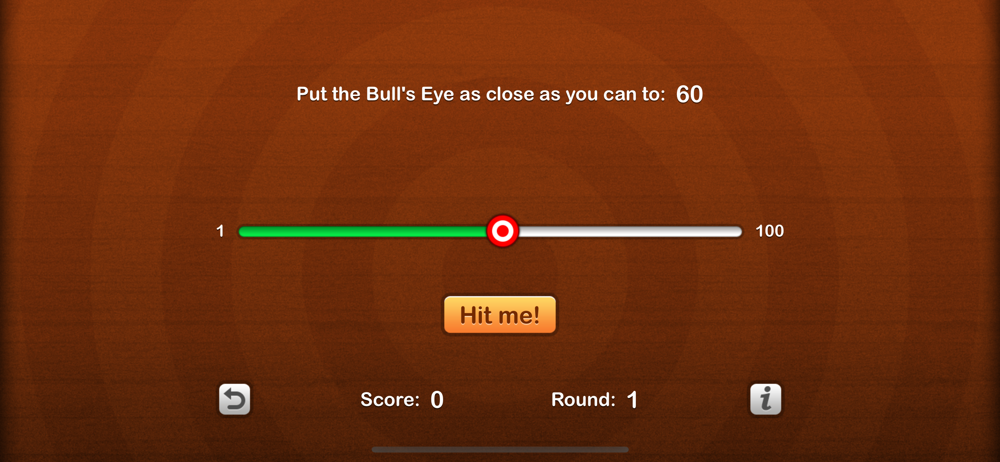
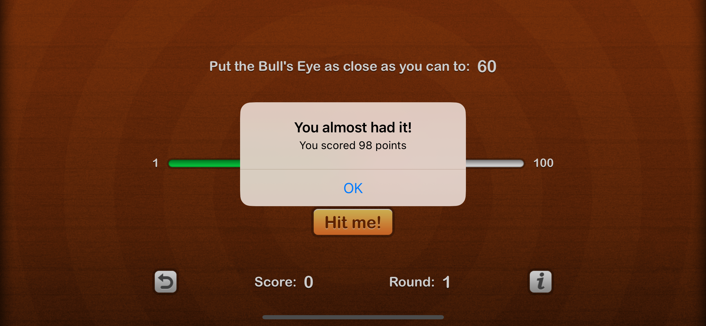
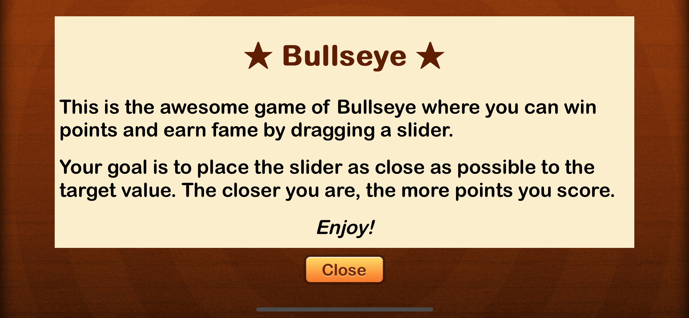

# Bulls Eye

## Table of contents
* [Video Link](#video-link)
* [Description](#description)
* [Features](#Features)
* [Screenshots](#screenshots)
* [Architecture](#architecture)
* [Contact](#contact)

## Video Link

[Bulls Eye]()

## Description

Bulls Eye is a thrilling game app that challenges your precision and accuracy skills. The objective of the game is simple - to hit the target value displayed on the screen by sliding a slider to reach the accurate value. The closer the player gets to the target value, the more points they score.

The game tracks the rounds and score, so players can keep track of their progress and see how they improve over time. If players want to start fresh or beat their high score, they can reset the game at any time.

The game's colorful and attractive graphics provide a fun and exciting atmosphere that will keep players engaged for hours.

In conclusion, Bulls Eye is a fun and challenging game that will test your precision and accuracy skills, while providing an entertaining and engaging gaming experience.

## Features

- A target value displayed on the screen.
- A slider that the player adjusts to reach the accurate value.
- Points awarded based on how close the player gets to the target value.
- Colorful and attractive graphics creating a fun and exciting atmosphere.
- Score tracking to monitor player progress.
- Ability to reset the game at any time.
- Diplaying information abut the game using `WKWebView`.

## Screenshots

Bulls Eye Screen           |  
:-------------------------:|
          |  

Displaying Scores          |  
:-------------------------:|
          |  

Information Screen         |  
:-------------------------:|
          | 

## Architecture

Bulls Eye app follows the Model-View-Controller (MVC) architecture pattern, which is commonly used in software development.

### Model:

The Model layer represents the data and business logic of the app. It is responsible for managing the data, storing it, and processing it. In the case of Bulls Eye, the Model layer might include information such as the target value, the player's score, and the current round.

### View:

The View layer is responsible for displaying the data in a user-friendly way. It handles all the layouts and user interface components, such as buttons and sliders. In the context of Bulls Eye, the View would display the target value and the slider for the player to adjust.

### Controller:

The Controller layer is responsible for handling the business logic of the app. It receives input from the user and communicates with the Model and View to update the data and the user interface. In the case of Bulls Eye, the Controller would handle the logic of calculating the player's score based on their input and updating the View to display the new score.

Overall, Bulls Eye's architecture provides a clear separation of concerns and helps ensure the app is scalable, maintainable, and easy to modify in the future.

## Contact
Kevin Topollaj, email: kevintopollaj@gmail.com - feel free to contact me!
