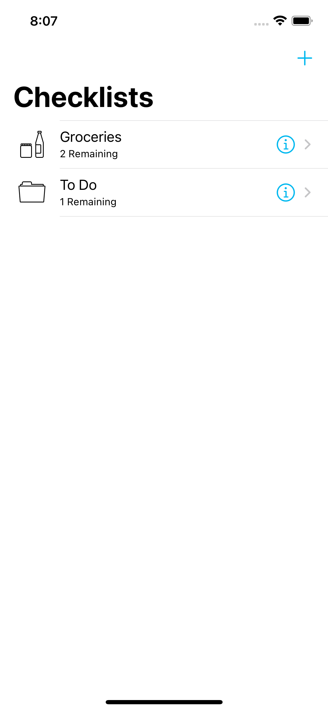
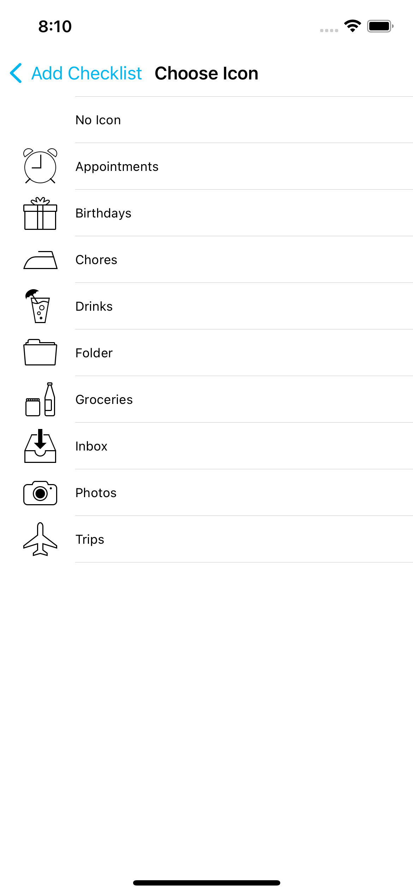
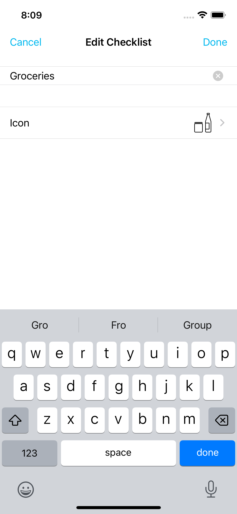
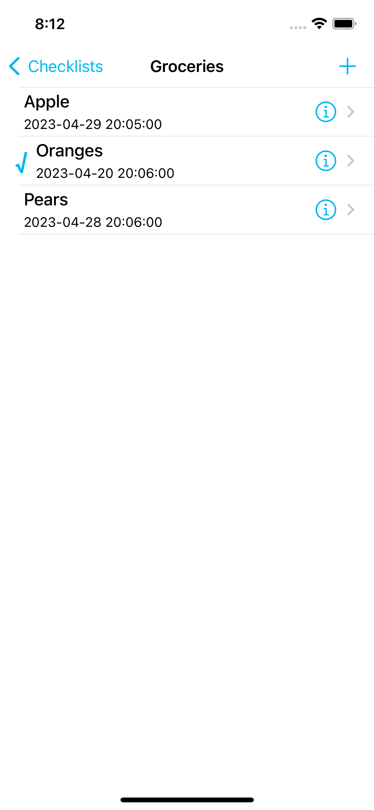
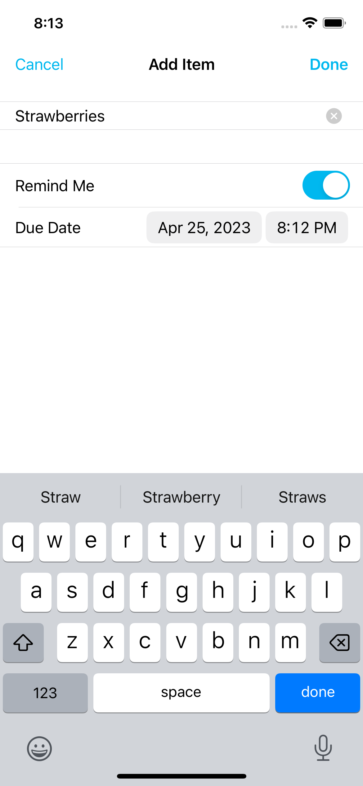
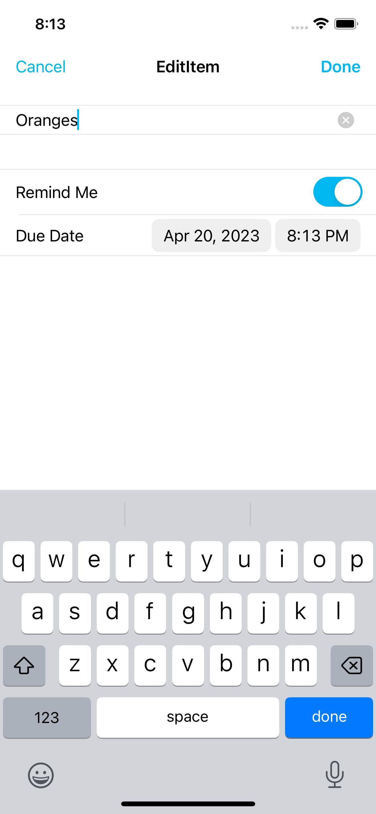
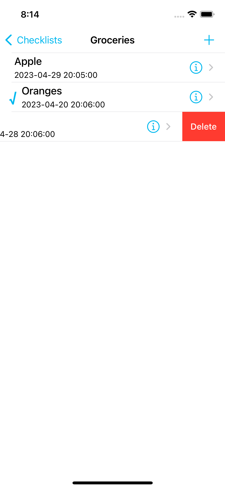

# Check List App

## Table of contents
* [Video Link](#video-link)
* [Screenshots](#screenshots)
* [Description](#description)
* [Features](#Features)
* [Architecture](#architecture)
* [Contact](#contact)

## Video Link

[Check List App](https://www.linkedin.com/feed/update/urn:li:activity:7055918241155547136/)

## Screenshots

Checklists                 | Add Checklist             | 
:-------------------------:|:-------------------------:|
 |  |

Choose Icon                | Edit Checklist            |
:-------------------------:|:-------------------------:|
 |  |

Checklist item             | Add Checklist Item        |
:-------------------------:|:-------------------------:|
 |  |

Edit Checklist item        | Delete Checklist Item     |
:-------------------------:|:-------------------------:|
 |  |

## Description

- CheckLists is a powerful productivity app that helps you stay organized and focused. 

- With CheckLists, you can easily create and manage to-do items, grouping them into customizable lists.

- Whether you're planning your daily tasks, tracking long-term goals, or simply making a grocery list, CheckLists has you covered.

- One of the key features of CheckLists is its reminder functionality. With just a few taps, you can set due dates and times for your to-do items, and the app will send you a notification on your iPhone when the deadline approaches. This way, you'll never forget an important task, even when you're not actively using the app.

- In addition, CheckLists automatically saves your data, ensuring that your to-do lists are always up-to-date.

- CheckLists is designed with a sleek and intuitive interface that's optimized for iOS.

- The app is fast, reliable, and easy to use, making it a perfect tool for anyone who wants to stay on top of their daily to-do list.

## Features

1. Intuitive TableView and Navigation Controller interface for easy organization of to-do items.

2. Follows the Model-View-Controller (MVC) design pattern to ensure efficient code architecture and easy maintainability.

3. Allows users to insert, edit, and delete to-do items, with the ability to swipe to delete for added convenience.

4. Implements the Delegate pattern to enhance modularity and flexibility.

5. Saves and loads user data, with the ability to handle multiple checklists and remember the last open list.

6. Utilizes User Defaults to provide a seamless and personalized user experience.

7. Offers a count for checked items in each checklist, as well as sorting in ascending order for enhanced usability.

8.  Has a unique color and app icon to match user preferences.

9. Requests user permissions for local notifications, with the ability to schedule reminders that will display even when the app is not running.

## Architecture

Check List App follows the Model-View-Controller (MVC) architecture pattern, which is commonly used in software development.

### Model:

The Model layer represents the data and business logic of the app. It is responsible for managing the data, storing it, and processing it.

### View:

The View layer is responsible for displaying the data in a user-friendly way. It handles all the layouts and user interface components.

### Controller:

The Controller layer is responsible for handling the business logic of the app. It receives input from the user and communicates with the Model and View to update the data and the user interface.

## Contact
Kevin Topollaj, email: kevintopollaj@gmail.com - feel free to contact me!
