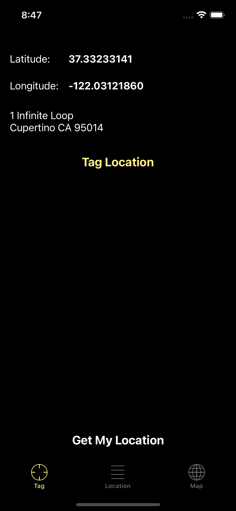
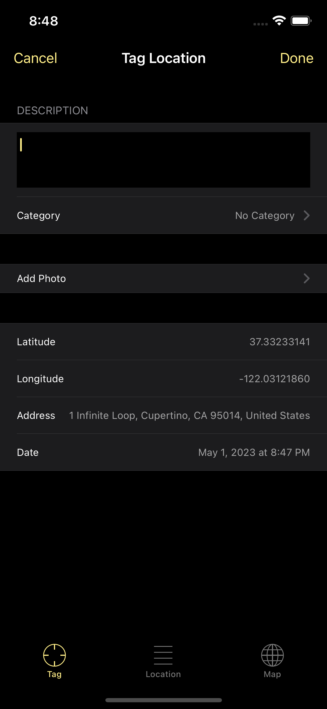
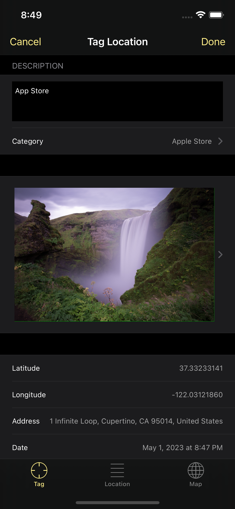
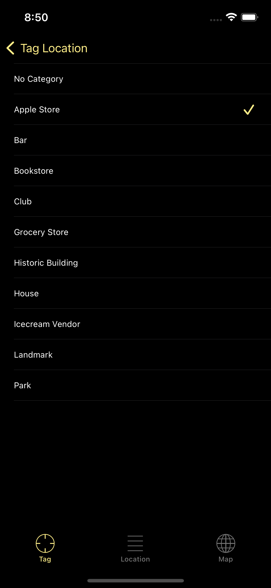
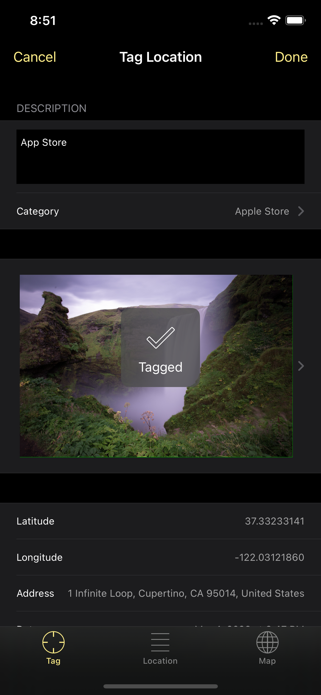
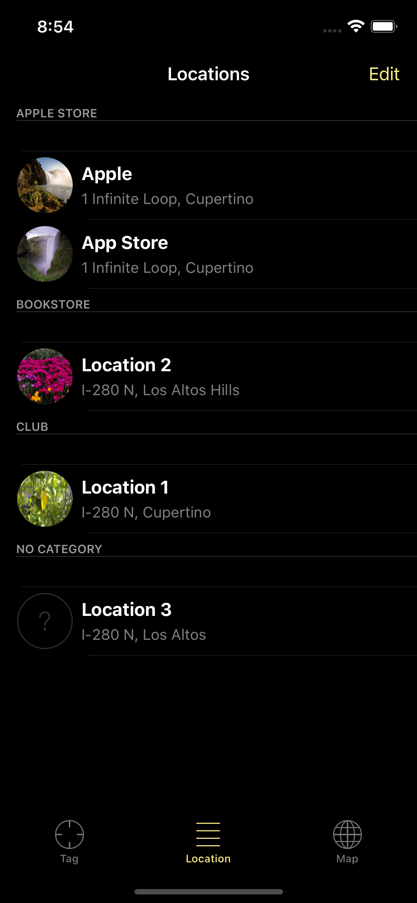

# My Locations

## Table of contents
* [Video Link](#video-link)
* [Description](#description)
* [Features](#Features)
* [Screenshots](#screenshots)
* [Architecture](#architecture)
* [Contact](#contact)

## Video Link

[Check List App]()

## Description

- 

## Features

- 

## Screenshots

Checklists                 | Add Checklist             | 
:-------------------------:|:-------------------------:|
          |          |

Choose Icon                | Edit Checklist            |
:-------------------------:|:-------------------------:|
          |          |

Checklist item             | Add Checklist Item        |
:-------------------------:|:-------------------------:|
          |          |

Edit Checklist item        | Delete Checklist Item     |
:-------------------------:|:-------------------------:|
          |          |

## Architecture

My Locations app follows the Model-View-Controller (MVC) architecture pattern, which is commonly used in software development.

### Model:

The Model layer represents the data and business logic of the app. It is responsible for managing the data, storing it, and processing it.

### View:

The View layer is responsible for displaying the data in a user-friendly way. It handles all the layouts and user interface components.

### Controller:

The Controller layer is responsible for handling the business logic of the app. It receives input from the user and communicates with the Model and View to update the data and the user interface.

## Contact
Kevin Topollaj, email: kevintopollaj@gmail.com - feel free to contact me!
