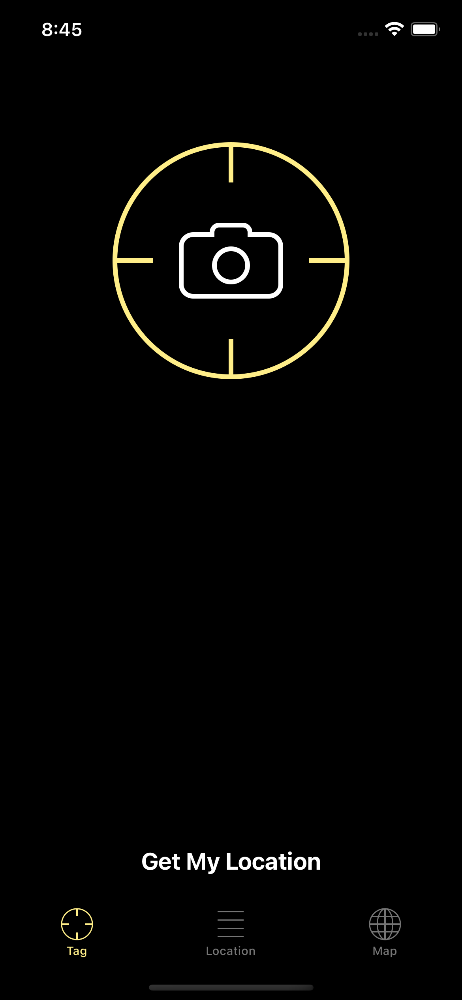
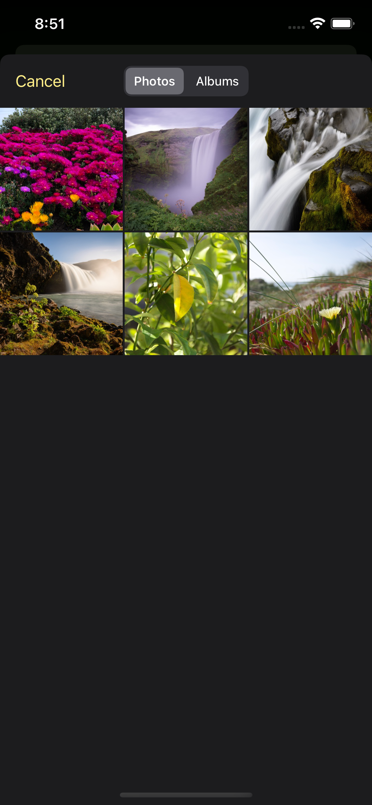

# My Locations

## Table of contents
* [Video Link](#video-link)
* [Description](#description)
* [Features](#Features)
* [Screenshots](#screenshots)
* [Architecture](#architecture)
* [Contact](#contact)

## Video Link

[My Locations](https://www.linkedin.com/feed/update/urn:li:ugcPost:7058883676406730752/)

## Description

- Introducing MyLocations iOS App, the ultimate app for keeping track of all your favorite spots! With MyLocations, you can easily tag any location you love and store all the details you need for easy reference later on.

- Getting started is a breeze - just use the Core Location framework to obtain GPS coordinates and convert them into a friendly address. Then, simply add all the details for your new location with the user-friendly Tag Location screen, featuring static cells for a familiar, intuitive experience. Plus, with Core Data integration, you can trust that all your data is safely stored and easily accessible.

- View all your tagged locations on an interactive map with Map Kit framework integration. You can even add photos to each location to keep your memories alive.

- MyLocations has custom graphics, sound effects, and animations.

- Stay organized and never forget your favorite spots again with MyLocations - the perfect app for adventurers, travelers, or anyone who wants to keep track of the best places they've been.

## Features

1. Get Location: Easily obtain GPS coordinates and convert them into an address with the Core Location framework.

2. Tag Location: Create a new location with a user-friendly screen for entering location details.

3. Store Data: Store all location data using Core Data for a more professional and efficient data storage solution.

4. Map View: View all your tagged locations on an interactive map with pins and user location tracking.

5. Add Photos: Snap and attach photos to your tagged locations with a seamless connection to the iPhone's camera and photo library.

6. Customization: Personalize your app with custom graphics, sound effects, and animations for a unique and engaging experience.

## Screenshots

Tag Tab                    | Tag Tab with Location     | 
:-------------------------:|:-------------------------:|
 |  |

Tag Location               | Tag Location with data    |
:-------------------------:|:-------------------------:|
 |  |

Categories List            | Image Picker View         |
:-------------------------:|:-------------------------:|
 |  |

Successfully tagged Location  | Location List Tab         |
:----------------------------:|:-------------------------:|
 |  |

Edit Location List            | Delete Location List      |
:----------------------------:|:-------------------------:|
 |  |

Map Tab Screen                | Map Screen with Pin       |
:----------------------------:|:-------------------------:|
 |  |

Edit Location Screen          | Successfully edited Location |
:----------------------------:|:----------------------------:|
 |  |

## Architecture

My Locations app follows the Model-View-Controller (MVC) architecture pattern, which is commonly used in software development.

### Model:

The Model layer represents the data and business logic of the app. It is responsible for managing the data, storing it, and processing it.

### View:

The View layer is responsible for displaying the data in a user-friendly way. It handles all the layouts and user interface components.

### Controller:

The Controller layer is responsible for handling the business logic of the app. It receives input from the user and communicates with the Model and View to update the data and the user interface.

## Contact
Kevin Topollaj, email: kevintopollaj@gmail.com - feel free to contact me!
