# Store Search

## Table of contents
* [Video Link](#video-link)
* [Screenshots](#screenshots)
* [Description](#description)
* [Features](#Features)
* [Architecture](#architecture)
* [Contact](#contact)

## Video Link

[Store Search](https://www.linkedin.com/feed/update/urn:li:activity:7065717813306343424/)

## Screenshots

Search Store               | Search Store Loading      | 
:-------------------------:|:-------------------------:|
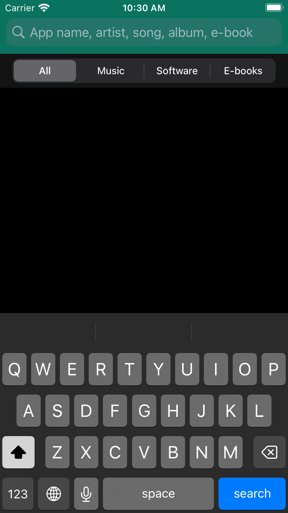 |  |

Search Store Result        | Search Store Categories   |
:-------------------------:|:-------------------------:|
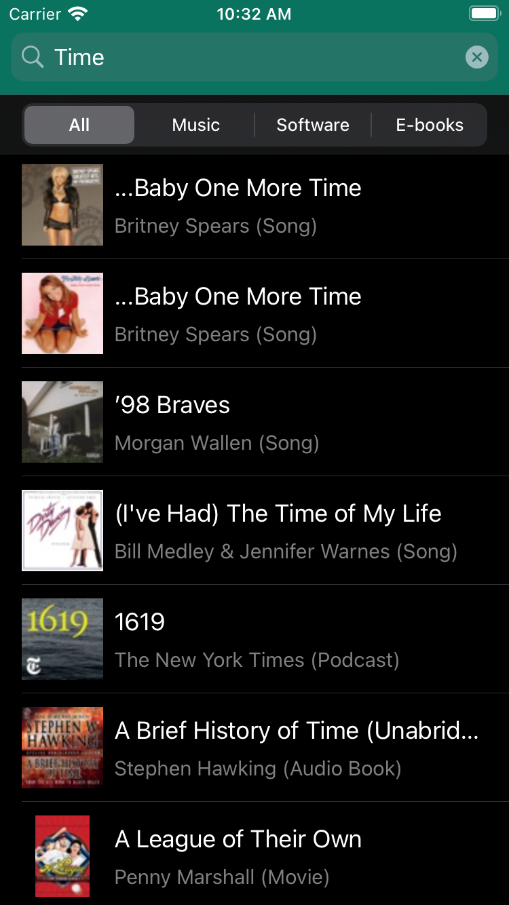 | 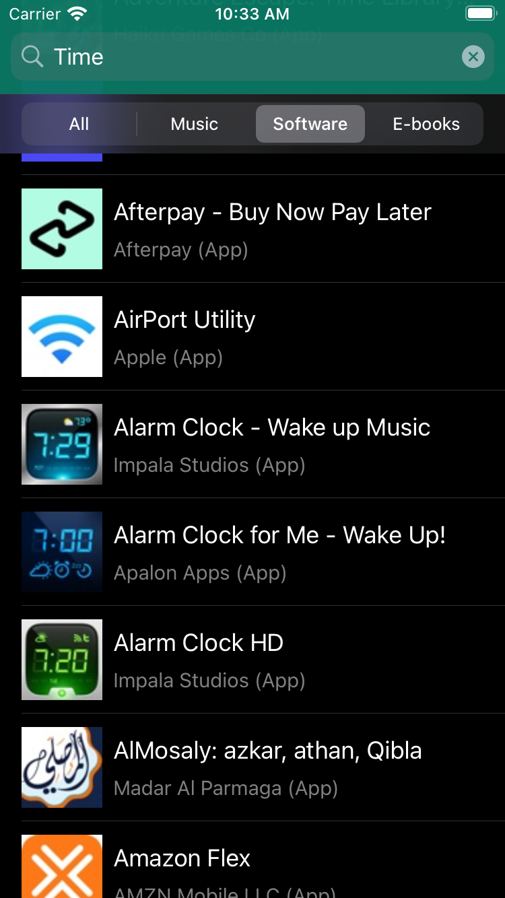 |

Search Store Detail Popup  | Search Store Safari        |
:-------------------------:|:-------------------------:|
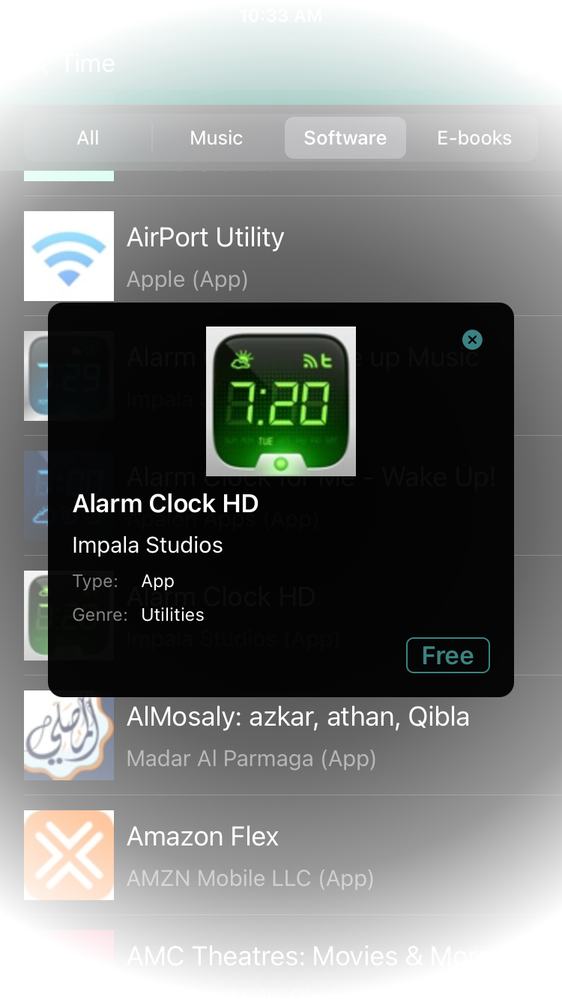 | 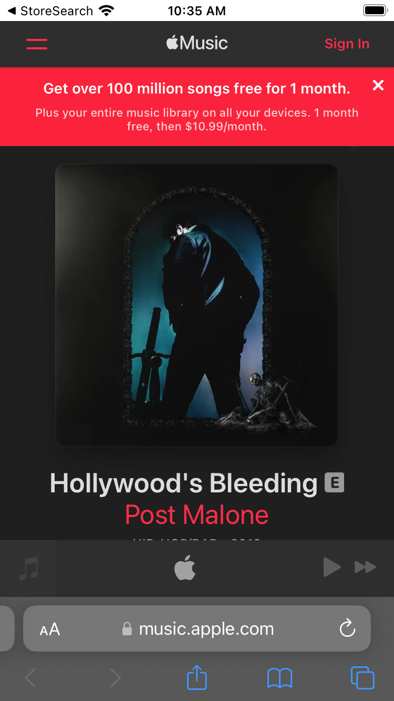 |

Search Store Landscape  | 
:----------------------------:|
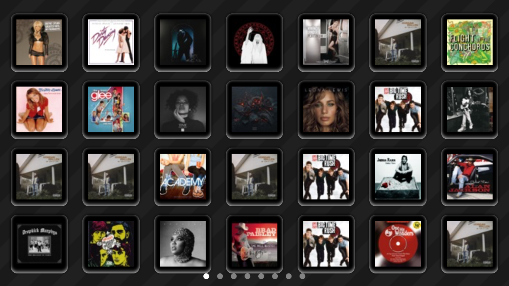 |

Search Store Landscape Detail Popup   | 
:------------------------------------:|
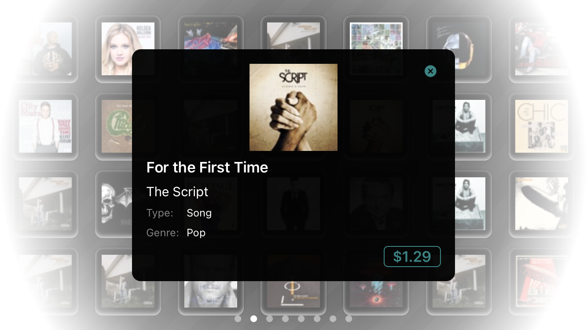 |

Search Store iPad Portrait    | 
:----------------------------:|
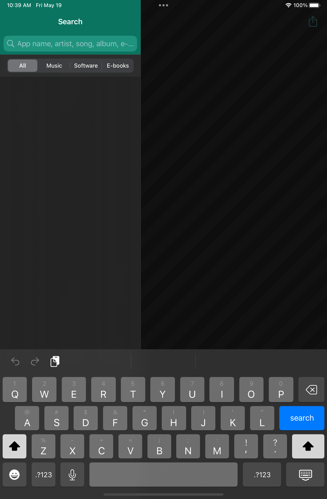 |

Search Store iPad Portrait Results  | 
:----------------------------------:|
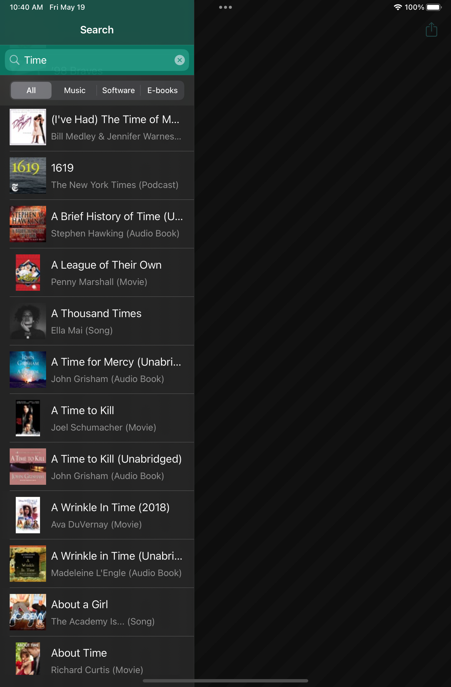 |

Search Store iPad Portrait Results Detail  | 
:-----------------------------------------:|
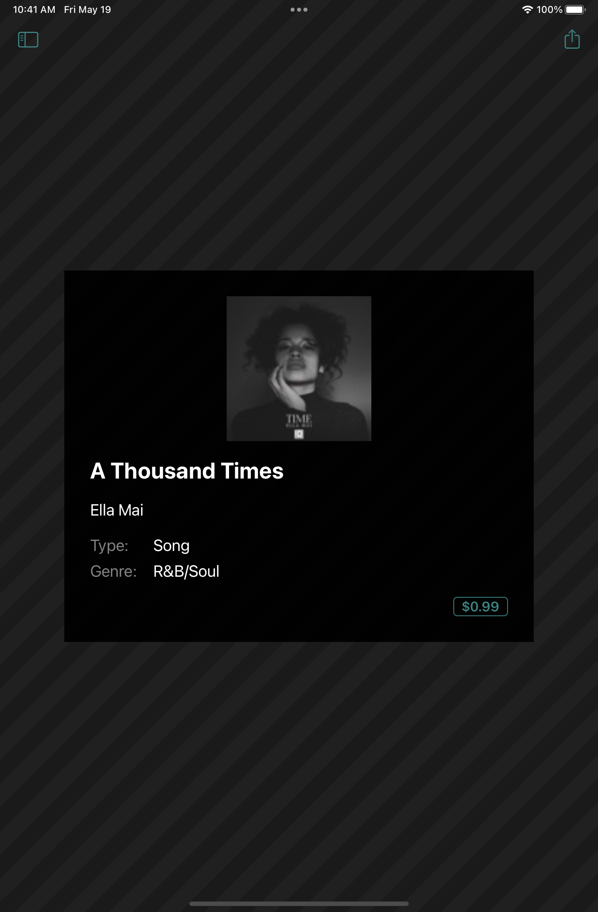 |

Search Store iPad Portrait Safari   | 
:----------------------------------:|
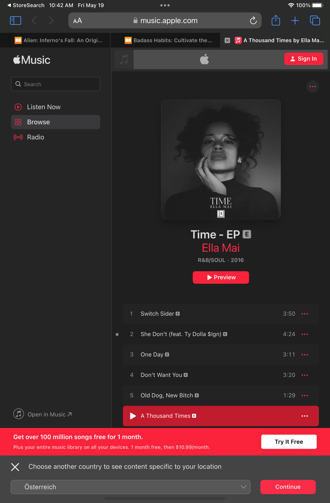 |

Search Store iPad Landscape         | 
:----------------------------------:|
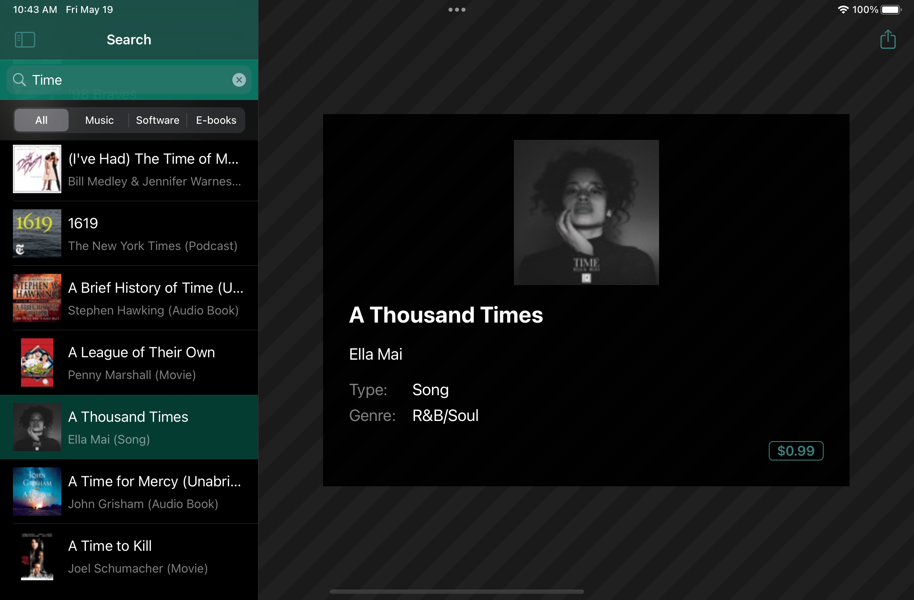> |

Search Store iPad Landscape Popup Menu   | 
:---------------------------------------:|
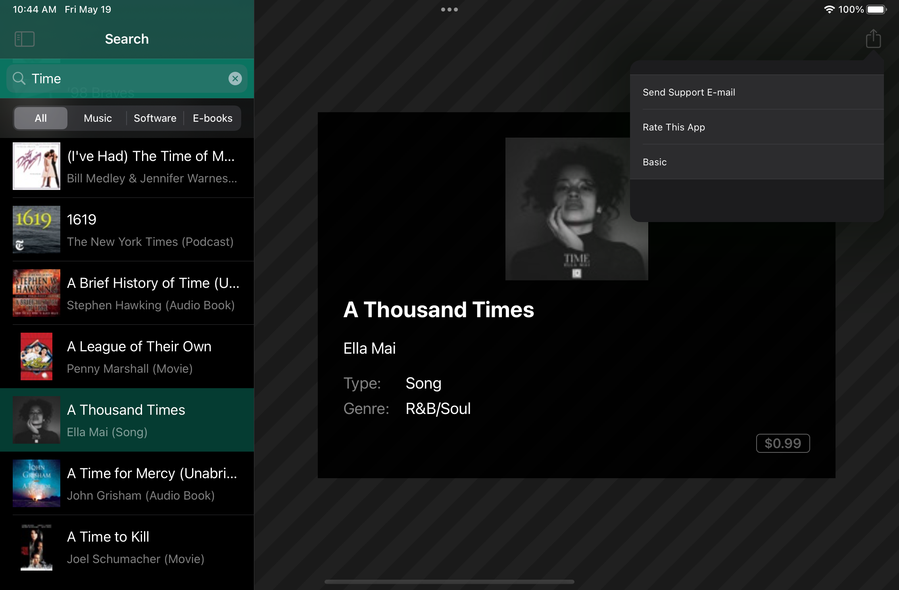 |

## Description

- Introducing Store Search, the ultimate iOS app for seamless content discovery in the iTunes Store. Navigate a world of music, movies, books, and more with ease.

- With its intuitive interface, Store Search delivers comprehensive search capabilities at your fingertips. Find what you need effortlessly, thanks to intelligent search handling and neatly organized results.

- Search Store crafts a visually captivating app interface that leaves a lasting impression. Customize its look with light and dark modes, following the latest design trends.

- Harness the might of Apple's iTunes Store through seamless web service integration. Efficiently query and retrieve information, while effortlessly parsing JSON data for a smooth user experience.

- Sort search results alphabetically, optimizing code efficiency. Experience optimal networking performance using asynchronous communication.

- Engage and inform users with sleek activity indicators, ensuring a seamless search experience. Tailor results to specific iTunes Store categories for personalized content.

- Enhance visual appeal with stunning artwork downloads, making search results captivating. Present detailed information in interactive pop-ups, supporting dynamic types for user accessibility.

- Immerse users with captivating transition animations, creating a seamless and delightful experience. Explore landscape views and grid-based layouts for effortless navigation.

- Store Search seamlessly adapts to iPads, providing a consistent experience. Handle different search states gracefully, ensuring a smooth user journey.

- Expand your reach with multilingual support and regional settings. Store Search delivers localized search results, making content discovery even more accessible.

- Discover a new world of content with Store Search, your iOS companion for effortless iTunes Store exploration.

## Features

1. Create the project: Create a new project and Set up version control using Git.

2. Create the UI: Create the user interface for StoreSearch.

3. Implement SearchController: Understand how the search bar works by getting the search term and populating the table view with search results.

4. Data model: Create a data model to hold the data for search results and allow for future expansion.

5. Custom table cells and nibs: Create, configure and use a custom table cell via nib file.

6. Change the look of the app: Change the look of the app to make support light and dark mode.

7. Query the iTunes web service: Using web services and the specifics about querying Apple’s iTunes Store web service.

8. Send an HTTP request: Create a proper URL for querying a web service and send a request to the server.

9. Parse JSON: Parse of the JSON information sent back from the server and convert that to objects with properties that can be used in your app.

10. Sort the search results: Explore different ways to sort the search results alphabetically so as to write the most concise and compact code.

11. Synchronous networking: Learn how synchronous networking can affect the performance of your app.

12. The activity indicator: Add an activity indicator to show when a search is going on so that the user knows something is happening.

13. Asynchronous networking: Change the code for web service requests to run on a background thread so that it does not lock up the app UI.

14. Use URLSession: Use the URLSession class for asynchronous networking.

15. Cancel operations: Canceling a running network request when a second network request is initiated.

16. Search different categories: Allow the user to select a specific iTunes Store category to search in instead of returning items from all categories.

17. Download the artwork: Download the images for search result items and display them as part of the search result listing.

18. Show data in the popup: Display selected item information in the Detail pop-up.

19. Dynamic type: Add support for dynamic type so that your text can display at a size specified by the user.

20. Gradients in the background: Add a gradient background to make the Detail pop-up background look more polished.

21. Animation!: Add transition animations so that your pop-up enters, and exits, the screen with some animation.

22. The landscape view: Create a landscape view and show all the searched items.

23. Add result buttons: Add buttons in a grid for the search results, so that the result list can be scrolled through.

24. Paging: Configure scrolling through results page-by-page rather than as a single scrolling list.

25. Download the images: Download the images for each search result item and display it in the scroll view.

26. Handle differend Search states like Loading and No result.

27. Add a new language: Add support for a new display language to your app.

28. Regional Settings: Modify the web query to send the device language and region to get localized search results.

29. Addapt the app for to be used also for iPad.

## Architecture

Store Search app follows the Model-View-Controller (MVC) architecture pattern, which is commonly used in software development.

### Model:

The Model layer represents the data and business logic of the app. It is responsible for managing the data, storing it, and processing it.

### View:

The View layer is responsible for displaying the data in a user-friendly way. It handles all the layouts and user interface components.

### Controller:

The Controller layer is responsible for handling the business logic of the app. It receives input from the user and communicates with the Model and View to update the data and the user interface.

## Contact
Kevin Topollaj, email: kevintopollaj@gmail.com - feel free to contact me!
